# b"Hello" | b"Halo..." 👋

You can call me Heru or Hez. My programming projects primarily focus on developing tools to improve the efficiency and accessibility of biodiversity research. I specialize in developing high-performance, memory-efficient tools that can scale from mobile devices and personal computers to [HPC clusters](https://en.wikipedia.org/wiki/High-performance_computing). My approach emphasizes developing software that’s user-friendly and cost-effective to develop and maintain.

For more insights into my work and adventures, visit [my website](https://hhandika.com/)!

<!-- START_SECTION:github-stats -->

  
  
  

*Stats reflect public repositories only. Updates daily • Latest update: July 10, 2026

<!-- END_SECTION:github-stats -->
