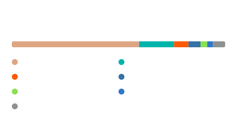
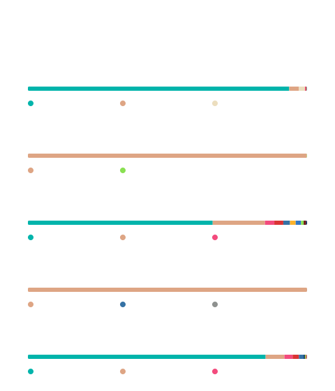

# b"Hello" | b"Halo..." 👋

You can call me Heru or Hez. I am an evolutionary biologist working with deep computational work. I develop evolutionary biology software that works like the day-to-day tools people already know. This means it must install in a single click through the official App Store. I work on finding solutions to develop high-performance, memory-efficient tools that can scale from mobile devices and personal computers to [HPC clusters](https://en.wikipedia.org/wiki/High-performance_computing). I also use my own software.

For more insights into my work and adventures, visit [my website](https://hhandika.com/)!

<!-- START_SECTION:github-stats -->

  
  
  

*Code changes are partial; omitted repositories are listed in <a href="data/stats.json">data/stats.json</a>.

Stats reflect public repositories only. Updates daily • Latest update: September 27, 2026

<!-- END_SECTION:github-stats -->
